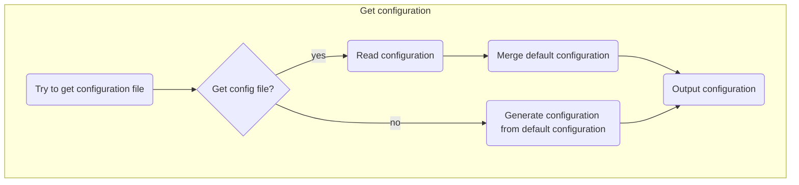

```mermaid
flowchart TD
  subgraph config [Get configuration]
    id1(Try to get configuration file)
    id2{Get config file?}
    id1 --> id2
    id2 --> |yes| id3(Read configuration)
    id2 --> |no| id4(Generate configuration from default configuration)
    id3 --> id5(Merge default configuration)
    id5 --> id6
    id4 --> id6(Output configuration)
  end
```
