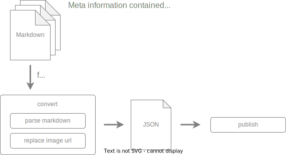

# documentaly publish

Can publish markdown to some platforms. For example notion, Zendesk.

## process

### convert
- parse markdown Parse markdown to html or json string that depend on output destination.
- replace image url Replace relative image url to absolute image url.

### publish
Publish to some platforms.
