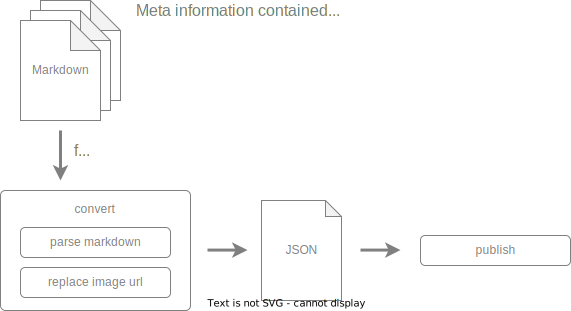

# documentaly publish

Can publish markdown to some platforms. For example Notion, Zendesk.

## process

### convert

- parse markdown Parse markdown to html or json string that depend on output
  destination.
- replace image url Replace relative image url to absolute image url.

### publish

Publish to some platforms.

# comand line argument

## zendesk

| key                       | description                                                                                                                  |
| ------------------------- | ---------------------------------------------------------------------------------------------------------------------------- |
| --zendesk-api-auth-header | `Authorization: <here>`.  [Detail is here.](https://developer.zendesk.com/api-reference/introduction/security-and-auth/) |

## Notion

| key              | description                                                                                 |
| ---------------- | ------------------------------------------------------------------------------------------- |
| --notion-api-key | Integration token.  [Detail is here.](https://developers.notion.com/docs/authorization) |

# markdown props

## base props

| name                    | type   | description                                                       |
| ----------------------- | ------ | ----------------------------------------------------------------- |
| dist                    | string | Name of platform on which to publish. ex. `Notion`, `zendesk` |
| imageUrlReplacementPath | string | Path of the image URL to be replaced                              |

## Zendesk props

| name      | type    | description |
| --------- | ------- | ----------- |
| subdomain | string  |             |
| articleId | string  |             |
| locale    | string  |             |
| draft     | boolean |             |
| title     | string  |             |

## Notion props

| name   | type   | description |
| ------ | ------ | ----------- |
| pageId | string |             |
| title  | string |             |
